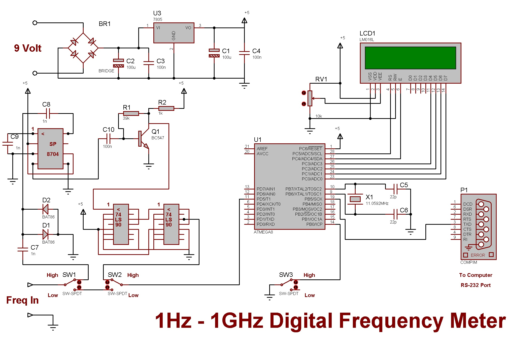

# AVR Frequency Meter

 

### This repository is an accurate and sensitive Frequency Meter.
This is an accurate and sensitive frequency meter with 6 decimal digits that can measure the frequency of one Hz to one GHz and has the ability to connect to a computer and display numbers. This frequency meter is designed and built using frequency divider ICs and has high sensitivity and accuracy. The mentioned project has two modes for high and low frequencies, and with the help of sliding keys, the device can be placed in one of two modes, Low Freq or High Freq. In Low Freq mode, the measurement range will be between 1 Hz to 4 MHz with an accuracy of three decimal places, and in High Freq mode, the measurement range will be between 1 MHz to 1 GHz and with an accuracy of 6 decimal places. In the design of this frequency meter, 3 frequency dividing ICs named SP8704 and SP7490 have been used. The first IC receives up to one gig input and divides the resulting frequency by 128. The result is divided by 10, and the result is multiplied by 12800 in the micro and displays the actual frequency. The input of this frequency meter can be sinusoidal or square. To connect the circuit to the COM or serial port of the computer with transfer rate 9600.

###### This repository contains Source Files & Proteus Circuit Simulation Files. 

---

 
